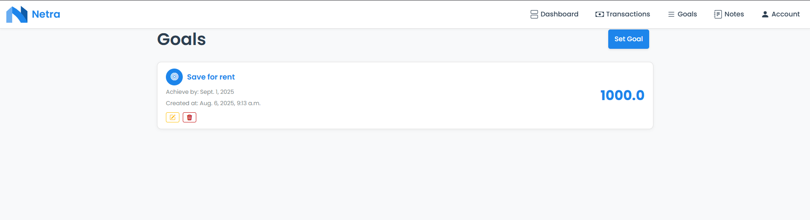

#  Netra
  <code></code>
  <code></code>
  <code></code>
  <code></code>
  <code></code>

# Index
- [Project Overview](#project-overview)
- [Features](#features)
- [Technologies Used](#technologies-used)
- [Installation Guide](#installation)
- [File Structure](#️file-structure)
- [Usage](#usage)
- [Author](#author)
- [Screenshots](#screenshots)
- [Misc](#misc)

# 📽️ [Project Overview](#️project-overview)
A webapp that allows you to manage and track your finances.

## [📱Features](#features)
- **Seamless Account Management**  
  Take control with a simple, secure account. Easily log in, log out, and manage your profile—including the power to delete your account whenever you choose.

- **Effortless Transaction Logging**  
  Track every dollar with our intuitive system. Log all your **Savings**, **Expenses**, and **Income** in one place to see where your money is going.

- **Your Personal Finance Journal**  
  Go beyond the numbers. Create **Financial Notes** to capture your thoughts, strategies, and observations about your spending habits.

- **Achieve Your Goals**  
  Turn your ambitions into reality. Set **Goals** to save for big purchases, pay down debt, or plan for the future.

- **Instant Financial Insights**  
  Get a clear picture of your finances at a glance. Our powerful **Statistics** feature gives you a quick overview of your daily, weekly, and monthly expenses and income.
## [⚙️ Used Technologies & Libraries](#️technologies-used)
 - Django - web framework
 - Python - main language
 - HTML, [Bootstrap](https://getbootstrap.com/) & CSS3 - page styling
 - [Bootstrap icons](https://icons.getbootstrap.com/)
 - [Django Widget Tweaks](https://pypi.org/project/django-widget-tweaks/)
 - *The rest can be found in [`requirments.txt`](requirments.txt)*

 ## [🗃️ File Structure](#file-structure)
    NETRA/
    ├── core/
    │   ├── __pycache__/
    │   ├── migrations/
    │   ├── templates/
    │   ├── __init__.py
    │   ├── admin.py
    │   ├── apps.py
    │   ├── checkers.py
    │   ├── forms.py
    │   ├── models.py
    │   ├── tests.py
    │   ├── urls.py
    │   └── views.py
    │
    ├── netra/
    │   ├── __pycache__/
    │   ├── __init__.py
    │   ├── asgi.py
    │   ├── settings.py
    │   ├── urls.py
    │   └── wsgi.py
    │
    ├── static/
    │   ├── logos/
    │   └── styles/
    │
    ├── staticfiles/
    ├── venv/
    ├── .gitignore
    ├── db.sqlite3
    ├── manage.py
    ├── README.md
    └── requirments.txt

## [📋 Prerequisites](#prerequisites)
Before you start, ensure you have the following installed on your machine:

- **Python 3.8+**
- **Django 3.0+**

You can install Python and Django by following the instructions on their official websites:
- [Python](https://www.python.org/downloads/)
- [Django](https://www.djangoproject.com/)

Alternatively, you can install Python and Django using `pip`.

### 🐍 Install Python
If you don’t have Python installed, you can download it from [python.org](https://www.python.org/downloads/). Once installed, verify the installation by running:

```bash
python --version
```

### 🟩 Install Django 

You can install Django using pip. Open your terminal/command prompt and run:

```bash
pip install django
```

# [📦 Installation of the project](#installation)
1. **Clone the project reposiotry** to your local machine  
  
    ```bash
    git clone https://github.com/GeorgievIliyan/Netra
    ```
2. **Create a virtual environment**: It’s good practice to use a virtual environment to manage your project’s dependencies. Run the following commands:
  
    ```bash
    # For Windows:
    python -m venv [environment_name]
    [environment_name]\Scripts\activate

    # For Mac/Linux:
    python3 -m venv [environment_name]
    source [environment_name]/bin/activate
    ```
3. **Install the dependencies**: With the virtual environment activated, install the project dependencies:
    ```bash
    pip install -r requirements.txt
    ```
4. **Open project folder**

    ```bash
    cd netra
    ```
5. **Run migrations <p style="color:red">crucial</p>**
    ```bash
    python manage.py makemigrations
    ```
6. **Create a super user** or use existing one
    ```bash
    # create superuser (admin):
    python manage.py createsuperuser

    # or use existing one
    username: admin
    password: admin
    ```
7. **Run the development server**  
Start the development server with the following command:
  
    ```bash
    python manage.py runserver
    ```
      
    You should recieve output like this:
    ```bash
    Starting development server at http://127.0.0.1:8000/
    ```
## [🔨 Usage](#usage)
  - To use the app navigate to the following addres in your search bar:
    
    ```bash
    http://127.0.0.1:8000/

    #or

    localhost:8000
    ```
  - To enter the admin panel navigate to the following addres:
    
    ```bash
    http://127.0.0.1:8000/admin/

    #or

    localhost:8000/admin/
    ```
    now can log in into the provided account or the one created by you.

- Log into the existing user account:
    ```bash
    username: user
    email: user@mail.com
    password: 1234

    URL:
    
    http://127.0.0.1:8000/auth/login

    #or

    localhost:8000/auth/login/
    ```
    or create a new one by navigating to:
    ```bash
    http://127.0.0.1:8000/auth/register/

    #or

    localhost:8000/auth/register/
    ```

# [👤 Author & Contacts](#author)
Iliyan Georgiev / Илиян Георгиев - *High School Student*  
GitHub: [@GeorgievIliyan](https://github.com/GeorgievIliyan)  
Discord: Bilko / bilko240

# [🖼️ Screenshots](#screenshots)

Dashboard:  
  


Goals:  
  


Notes: 


Account details:


# [📁 Misc](#misc)

- The name: Netra, a name derived from Sanskrit and Hindi meaning "eye," suggests a watchful and clear perspective. This app aims to give users a sharp and insightful view into their financial world.